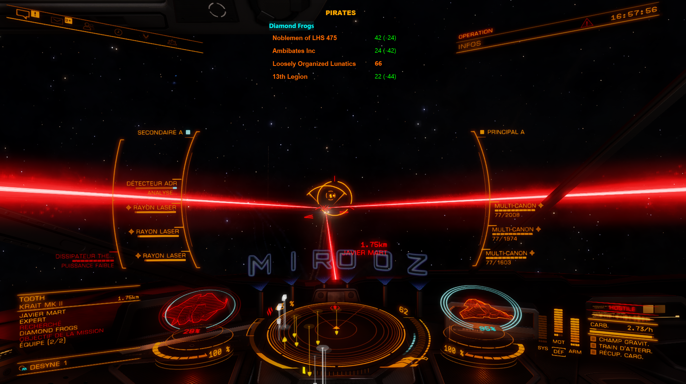

# Elite Dangerous Dashboard

## Description

**Elite Dangerous Dashboard** is a comprehensive companion application designed to optimize your Elite Dangerous gaming experience. The application analyzes game journal files in real-time to provide detailed insights into your missions, combat activities, and mining operations. Whether you're focused on massacre missions, conflict zones, or mining expeditions, this dashboard helps you track progress, find opportunities, and maximize your earnings.

## 🎯 Main Features

### 📊 **Massacre Stacking Management**
- **Mission stacking** : Visualize all your active massacre missions with real-time progression
- **System search** : Find systems conducive to massacre missions via EdTools API
- **Conflict search** : Locate civil war and conflict zones via Inara API
- **Bounty tracking** : History of destroyed ships with bounties and timestamps
- **Financial tracking** : Track pending and potential credits from missions


### ⛏️ **Mining Operations Tracker**
- **Session tracking** : Monitor your mining sessions with detailed statistics
- **Mineral analysis** : Track quantities and values of mined materials
- **Price comparison** : Compare best prices vs station prices for optimal selling
- **Mining history** : View completed sessions with duration and earnings
- **Real-time updates** : Live tracking of mining activities as they happen


### 🚀 **Advanced Features**
- **New commander detection** : Automatic popup and journal re-reading when switching commanders
- **Real-time reading** : Automatic monitoring of new journal files
- **Elite Dangerous interface** : Visual theme consistent with the game universe
- **Network error handling** : Translated error popups in case of connection issues
- **Bilingual interface** : English and French with explanatory descriptions
- **Loading indicators** : Visual feedback during data processing
- **Automatic updates** : Real-time synchronization with game events


## 🛠️ Installation

### **Simple Installation (Recommended)**
1. Download `EliteWarboard-Setup.exe` from releases
2. Run the installer
3. Launch the application from Start Menu or desktop

**✅ No external downloads required** : JDK and JavaFX are embedded in the installer. No Java installation or additional dependencies needed.

### **Configuration**
1. On first launch, configure your Elite Dangerous journal folder
2. Default location: `C:/Users/[YourName]/Saved Games/Frontier Developments/Elite Dangerous`
3. Select your language (English/French)
4. The application automatically starts analyzing your journals

## 🎮 Usage

### **Massacre Stacking Interface**
- **Header** : Overview of active massacre missions, credits and statistics
- **Left panel** : Destroyed ships journal and bounty tracking
- **Center panel** : Mission list with massacre and conflict filters
- **Right panel** : Target faction statistics (Pirates/Conflict zones)
- **Footer** : Commander information and current system
- **Kills remaining overlay** : Visual indicator of remaining kills



### **Mining Interface**
- **Mining panel** : Real-time mining session tracking
- **Mineral tracking** : Live updates of mined materials and quantities
- **Price toggle** : Switch between best prices and station prices
- **Session history** : Complete history of mining sessions with statistics
- **Loading indicators** : Visual feedback during data processing
- **Prospector Overlay** : Displays an overlay on your Elite Dangerous game window


### **Combat System Search**
1. Click "SEARCH COMBAT SYSTEMS" in the header
2. Choose "MASSACRE" or "CONFLICT" tab
3. Configure your search criteria
4. Click "SEARCH" to get results
5. Click on a system to copy it to clipboard


### **Mining System Search**
1. Click "SEARCH MINING SYSTEMS" in the mining panel
2. Select the mineral you want to mine
3. The system finds the most profitable station with mining locations
4. View results with station information and prices
5. Switch between different stations and rings as needed
6. Click on a station to copy system name to clipboard


### **Mission Filtering**
- **Type** : All, Massacre, Conflict
- **Status** : All, Active, Completed, Failed
- **Faction** : Click on a row in statistics to filter

## 🌐 Language Support

The application is available in **English and French** with complete interface translation including:
- All menus and buttons
- Error messages and notifications
- System search descriptions
- Mission types and statuses

## 🔧 Technologies Used

- **JavaFX 17** : Modern user interface
- **Maven** : Project management and automated build
- **Jackson** : JSON journal file analysis
- **Lombok** : Boilerplate code reduction
- **EdTools API** : Massacre system search
- **Inara API** : Conflict zone search
- **jpackage** : Installer creation with embedded runtime

## 📁 Project Structure

```
elite-dashboard/
├── elite-warboard-missions/          # Main application module
│   ├── src/main/java/be/mirooz/elitedangerous/dashboard/
│   │   ├── controller/               # JavaFX controllers and UI management
│   │   ├── handlers/                 # Journal event handlers and processors
│   │   ├── model/                    # Data models, enums, and registries
│   │   ├── service/                  # Business services (APIs, Journal, Localization)
│   │   └── ui/                       # Custom UI components and managers
│   ├── src/main/resources/
│   │   ├── css/                      # Elite Dangerous theme and styling
│   │   ├── fxml/                     # User interface layouts
│   │   ├── images/                   # Icons, images, and assets
│   │   └── messages_*.properties     # English and French translations
│   └── installer.iss                  # Inno Setup installation script
├── edtools-client/                   # EdTools API client library
├── inara-client/                     # Inara API client library
├── elite-commons/                    # Shared utilities and common code
└── journal-analyzer/                # Journal file analysis tool
```

## 📋 Supported Journal Events

The application automatically processes these Elite Dangerous events:

### **Mission Events**
- `MissionAccepted` : Adds a new mission with target faction and destination
- `MissionCompleted` : Marks a mission as completed
- `MissionFailed` : Marks a mission as failed
- `MissionRedirected` : Handles massacre mission completion and redirection
- `MissionAbandoned` : Marks a mission as abandoned
- `MissionExpired` : Handles expired missions
- `MissionProgress` : Updates mission progress

### **Combat Events**
- `Bounty` : Updates kill counters and bounty rewards for massacre missions
- `RedeemVoucher` : Resets bounty and combat bond statistics after redemption
- `FactionKillBond` : Tracks faction kill bonds
- `CommitCrime` : Records criminal activities
- `Died` : Handles commander death events
- `ShipTargeted` : Tracks ship targeting events

### **Mining Events**
- `MiningRefined` : Tracks refined materials and adds to mining statistics
- `Cargo` : Monitors cargo changes during mining operations
- `ProspectedAsteroid` : Records asteroid prospecting data and core materials
- `AsteroidCracked` : Tracks asteroid destruction for core mining
- `LaunchDrone` : Monitors mining drone deployment
- `EjectCargo` : Tracks cargo ejection during mining
- `BuyDrones` : Records mining drone purchases
- `SellDrones` : Records mining drone sales
- `MarketSell` : Tracks mineral sales and updates mining statistics

### **Ship Events**
- `Loadout` : Updates ship configuration and cargo capacity
- `LoadGame` : Sets commander online status
- `Location` : Updates current system and station position
- `Docked`/`Undocked` : Tracks docking status and station information
- `FSDJump` : Tracks system jumps and updates mining session status
- `SupercruiseEntry`/`SupercruiseExit` : Monitors supercruise transitions
- `ShutDown` : Handles ship shutdown events

### **Commander Events**
- `Commander` : Detects commander changes and triggers popup notifications

## 🌐 External APIs

- **EdTools PvE** : Massacre system search, faction conflict data, and mining system information
- **Inara** : Conflict zone and civil war search, station information, and mining commodity prices
- **Error handling** : Translated network error popups with user-friendly messages
- **Real-time data** : Live API integration for up-to-date system information
- **Fallback mechanisms** : Graceful handling of API unavailability

## 🎨 User Interface

- **Elite Dangerous theme** : Characteristic orange/cyan colors
- **Styled ComboBoxes** : Consistent filter styling
- **Contextual popups** : Error messages and notifications
- **Responsive** : Adaptive interface with optimized padding and spacing
- **Bilingual** : Complete English/French support

## 🚀 Build and Development

### **Local Build**
```bash
mvn clean install
```

### **Installer Creation**
```bash
mvn clean install
# Automatically generates EliteWarboard-Setup.exe with embedded runtime
```

### **Development**
```bash
mvn exec:java
```

## 📝 Changelog

### Version 1.1.0
- ✅ **Mining Operations Tracker** : Complete mining session tracking with real-time updates
- ✅ **Mining System Search** : Find optimal mining locations with mineral filters
- ✅ **Mineral Analysis** : Track quantities and values of mined materials
- ✅ **Price Comparison** : Toggle between best prices and station prices
- ✅ **Mining History** : View completed sessions with detailed statistics
- ✅ **Improve massacre stacking UI** : Visual improvements
- ✅ **Automatic commander detection** : Notification popup with automatic journal re-reading
- ✅ **Network error handling** : Translated error popups for connection issues
- ✅ **Styled ComboBoxes** : Enhanced mission filters with Elite Dangerous styling

### Version 1.0.0
- ✅ **Massacre Stacking Management** : Real-time massacre mission tracking and stacking
- ✅ **System Search** : Find combat systems via EdTools and Inara APIs
- ✅ **Destroyed Ships Journal** : Complete bounty tracking
- ✅ **Faction Statistics** : Detailed faction bounty analysis
- ✅ **Interactive Filtering** : Advanced mission and faction filtering
- ✅ **Elite Dangerous Theme** : Authentic game interface styling
- ✅ **Wing Mission Support** : Automatic wing mission detection
- ✅ **Automatic Reset** : Bounty statistics reset on redemption
- ✅ **Bilingual interface** : Complete English/French support

## 🤝 Contributing

1. Fork the project
2. Create a feature branch (`git checkout -b feature/AmazingFeature`)
3. Commit your changes (`git commit -m 'Add some AmazingFeature'`)
4. Push to the branch (`git push origin feature/AmazingFeature`)
5. Open a Pull Request

## 📄 License

This project is licensed under the MIT License. See the `LICENSE` file for details.

## 🆘 Support

If you encounter issues:

1. Verify your Elite Dangerous journal folder is correctly configured
2. Ensure Elite Dangerous is generating journal files
3. Check your internet connection for system searches
4. Open a GitHub issue with your problem details

## 🎯 Project Goal

**Elite Dangerous Dashboard** is designed to optimize your Elite Dangerous experience across multiple gameplay styles. Whether you're focused on combat missions, mining operations, or exploration, this dashboard helps you:

### **For Combat Pilots**
- **Efficiently stack** massacre missions to maximize earnings
- **Quickly find** the best systems for combat missions
- **Track in real-time** your mission progression and kills
- **Optimize** your credit and reputation farming strategy

### **For Miners**
- **Monitor mining sessions** with detailed real-time statistics
- **Track mineral values** and compare prices for optimal selling
- **Analyze mining efficiency** through session history and statistics
- **Maximize profits** by choosing the best selling locations

### **For All Commanders**
- **Comprehensive tracking** of all your Elite Dangerous activities
- **Real-time updates** as you play the game
- **Bilingual support** in English and French
- **Professional interface** that matches the Elite Dangerous universe

The application is completely self-contained and requires no external dependency installation.