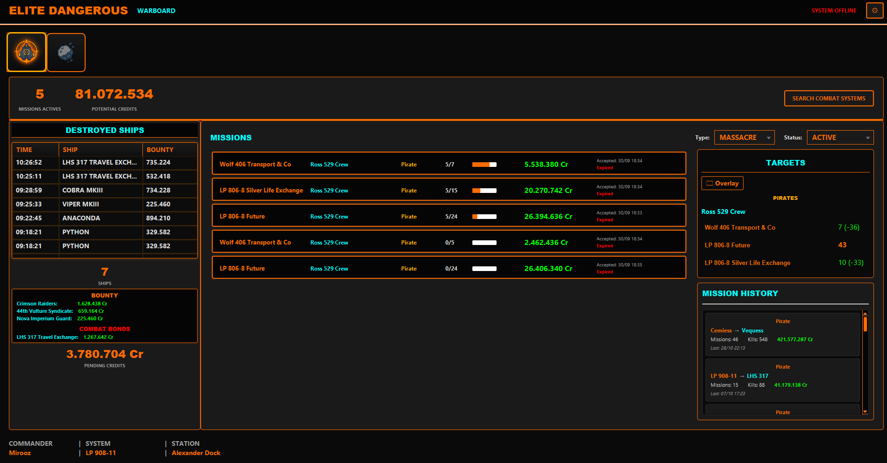
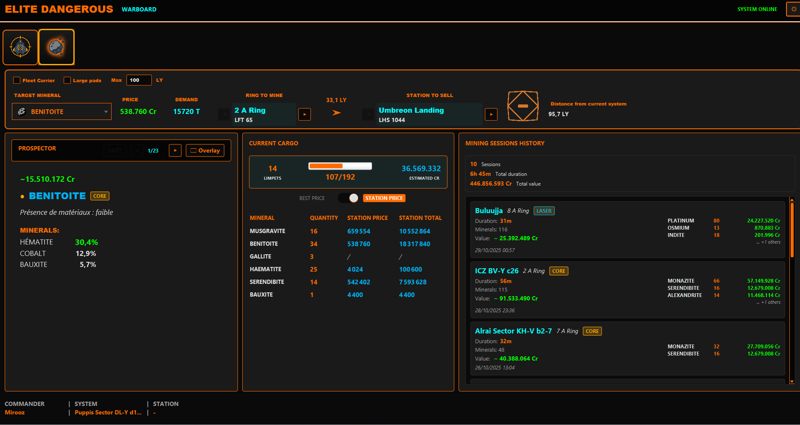
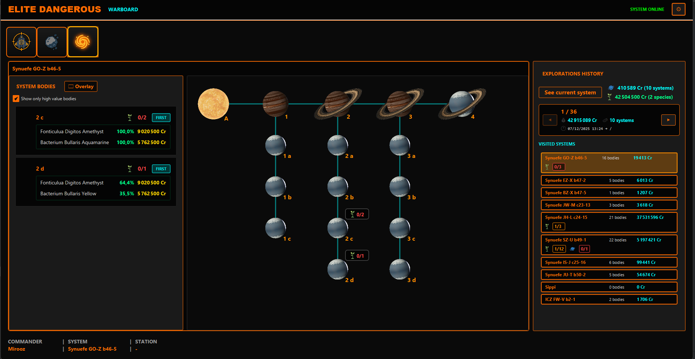
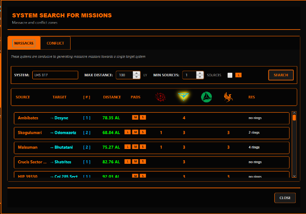
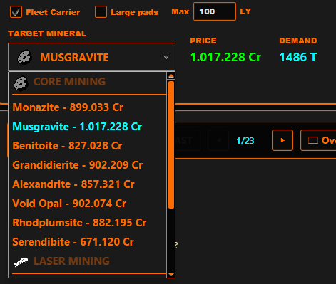
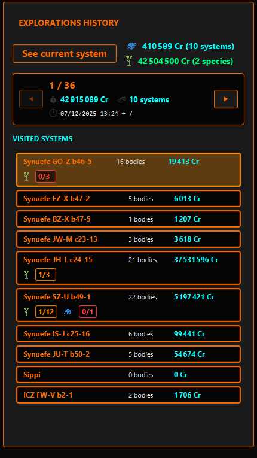

# Elite Dangerous Warboard

## Description

**Elite Warboard** is a comprehensive companion application designed to optimize your Elite Dangerous gaming experience. The application analyzes game journal files in real-time to provide detailed insights into your missions, combat activities, mining operations, and exploration. Whether you're focused on massacre missions, conflict zones, mining expeditions, or deep space exploration, this dashboard helps you track progress, find opportunities, and maximize your earnings.

## 🎯 Main Features

### 📊 **Massacre Stacking Management**
- **Mission stacking** : Visualize all your active massacre missions with real-time progression. Kills from pirate massacre missions stack — meaning a single pirate kill can count simultaneously toward multiple missions, even if they come from different factions.
  This tool provides a clear visual breakdown of your remaining kills per faction, helping you track and optimize your bounty grind efficiently.
- **Conflict zone management** : Track your conflict zone progression and bounty rewards. The application automatically tracks your conflict zone progression and combat bonds.
- **System search** : Find systems conducive to massacre missions via EdTools API
- **Conflict search** : Locate civil war and conflict zones via Inara API
- **Bounty tracking** : History of destroyed ships with bounties and timestamps
- **Financial tracking** : Track pending and potential credits from missions
- **Combat history** : View massacre/conflict sessions with kills and earnings



### ⛏️ **Mining Operations Tracker**
- **Session tracking** : Monitor your mining sessions with detailed statistics
- **Mineral analysis** : Track quantities and values of mined materials
- **Price comparison** : Compare best prices vs station prices for optimal selling
- **Mining history** : View completed sessions with duration and earnings
- **Real-time updates** : Live tracking of mining activities as they happen



### 🌌 **Exploration Panel**
- **System visual view** : Interactive orrery view showing all celestial bodies in the current system
- **Celestial body tracking** : Track all scanned planets, moons, and stars with detailed information
- **Exobiology tracking** : Monitor organic species detection and collection with X/Y counters
- **Mapping tracking** : Track mapped planets with visual indicators (X/Y mappable planets)
- **Exploration history** : Navigate through exploration groups with earnings and system counts
- **System value calculation** : Real-time calculation of system value including celestial bodies and exobiology bonuses
- **On-hold data tracking** : Monitor unsold exploration and organic data with credit values
- **High-value filter** : Filter to show only high-value celestial bodies
- **JSON detail panel** : View complete JSON data for any celestial body
- **Exploration overlay** : Display exploration bodies overlay on your Elite Dangerous game window
- **First discovery tracking** : Track first discoveries and first footfalls
- **Real-time updates** : Live tracking of scans, organic scans, and exploration data sales



### 🚀 **Advanced Features**
- **New commander detection** : Automatic popup and journal re-reading when switching commanders
- **Real-time reading** : Automatic monitoring of new journal files
- **Elite Dangerous interface** : Visual theme consistent with the game universe
- **Network error handling** : Translated error popups in case of connection issues
- **Bilingual interface** : English and French with explanatory descriptions
- **Loading indicators** : Visual feedback during data processing
- **Automatic updates** : Real-time synchronization with game events

## 🎮 Usage

### **Massacre Stacking Interface**
- **Header** : Overview of active massacre missions, credits and statistics
- **Left panel** : Destroyed ships journal and bounty tracking
- **Center panel** : Mission list with massacre and conflict filters
- **Right panel** : Target faction statistics (Pirates/Conflict zones)
- **Footer** : Commander information and current system
- **Kills remaining overlay** : Visual indicator of remaining kills


### **Mining Interface**
- **Mining panel** : Real-time mining session tracking
- **Mineral tracking** : Live updates of mined materials and quantities
- **Price toggle** : Switch between best prices and station prices
- **Session history** : Complete history of mining sessions with statistics
- **Loading indicators** : Visual feedback during data processing
- **Prospector Overlay** : Displays an overlay on your Elite Dangerous game window


### **Exploration Interface**
- **Exobiology probability calculation** : Advanced probability calculations based on big data from [Canonn Bioforge](https://bioforge.canonn.tech/)
  - Uses histogram data from thousands of scanned planets to predict species appearance
  - Calculates probabilities based on multiple factors: body type, atmosphere, volcanism, temperature, gravity, and pressure
  - Geometric mean probability calculation combined with global species rarity correction
  - Displays species probabilities for each planet based on detected biological signals
  - Filters species with probability < 1% to show only likely candidates


- **Exobiology radar (compass)** : Real-time navigation radar for biological sample collection
  - **Compass display** : Circular radar showing cardinal directions (N, S, E, W) with Elite Dangerous orange theme
  - **Position indicator** : Green triangle showing your current heading and position
  - **Sample markers** : Color-coded points for collected biological samples
    - First sample: Magenta (#FF00FF)
    - Second sample: Cyan (#00FFFF)
    - Third and subsequent samples: Yellow (#FFFF00)
  - **Exclusion circles** : Dashed circles around each sample showing the minimum distance (colony range) between biological colonies
  - **Distance display** : Real-time distance in meters to each collected sample displayed next to the radar
  - **Minimum distance indicator** : Shows the required minimum distance between samples (colony range) for the current species
  - **Real-time updates** : Updates every 500ms by reading your position from Elite Dangerous Status.json file
  - **Automatic activation** : Radar appears automatically when you start collecting biological samples on a planet


- **System visual view** : Interactive orrery with zoom and pan capabilities showing celestial body positions
- **Bodies list panel** : Complete list of all celestial bodies in the system with filtering options
- **Exploration history panel** : Navigate through exploration groups with previous/next buttons
- **System cards** : Visual cards showing system name, body count, value, exobiology status (X/Y species), and mapping status (X/Y planets)
- **On-hold indicators** : Display of unsold exploration data and organic data with credit values
- **Current system button** : Quick navigation to the currently visited system
- **Body detail panel** : JSON tree view showing complete data for selected celestial bodies
- **Exploration overlay** : Overlay window displaying exploration bodies on your game screen
- **Visual indicators** : Color-coded species collection status (red: 0/Y, orange: partial, green: Y/Y complete)
- **Mapping indicators** : Color-coded mapping status for mappable planets

### **Combat System Search**
1. Click "SEARCH COMBAT SYSTEMS" in the header
2. Choose "MASSACRE" or "CONFLICT" tab
3. Configure your search criteria
4. Click "SEARCH" to get results
5. Click on a system to copy it to clipboard



### **Mining System Search**
1. Select the mineral you want to mine
2. The system finds the most profitable station with mining locations
3. View results with station information and prices
4. Switch between different stations and rings as needed
5. Click on a station to copy system name to clipboard



### **Exploration History**
- **System visit history** : Browse through all visited systems organized by exploration groups
  - Navigate between exploration groups using Previous/Next buttons
  - View total earnings, system count, and time range for each group
  - Click on any system card to view it in the system visual view
- **Current data tracking** : Monitor unsold exploration and exobiology data
  - **Current exploration** : Shows total credits and system count for unsold exploration data
  - **Current exobiology** : Shows total credits and species count for unsold organic data
- **System cards** : Display system name, body count, value, exobiology status (X/Y species), and mapping status (X/Y planets)
- **Quick navigation** : "See current system" button automatically finds and displays your current location



### **VR Integration**
- **Keyboard and HOTAS binding** : Configure a key or HOTAS button to show/hide the dashboard
  - **Keyboard binding** : Bind any keyboard key to toggle dashboard visibility
  - **HOTAS binding** : Bind any button on your HOTAS controller (throttle, joystick, etc.) to toggle the dashboard
  - **Configuration** : Set up your bindings in the application preferences/settings menu


## 🌐 Language Support

The application is available in **English and French** with complete interface translation including:
- All menus and buttons
- Error messages and notifications
- System search descriptions
- Mission types and statuses

## 🛠️ Installation

### **Windows**
1. Download `EliteWarboard-Setup.exe` from releases
2. Run the installer
3. Launch the application from Start Menu or desktop

### **Linux**
1. Download `.deb` or `.flatpak`  from releases

**✅ No external downloads required** : JDK and JavaFX are embedded in the installer. No Java installation or additional dependencies needed.

### **Configuration**
1. On first launch, configure your Elite Dangerous journal folder
2. Default location: `C:/Users/[YourName]/Saved Games/Frontier Developments/Elite Dangerous`
3. Select your language (English/French)
4. The application automatically starts analyzing your journals


## 🔧 Technologies Used

- **JDK 17** : Java Development Kit
- **JavaFX 17** : Modern user interface
- **Maven** : Project management and automated build
- **Jackson** : JSON journal file analysis
- **Lombok** : Boilerplate code reduction
- **EdTools API** : Massacre system search and hotspot detection
- **Inara API** : Conflict zone search and market information
- **Canonn Bioforge** : Big data exobiology species probability calculations based on [bioforge.canonn.tech](https://bioforge.canonn.tech/)
- **Inno Setup** : Installer creation with embedded runtime
- **jpackage** : Installer creation with embedded runtime

## 📁 Project Structure

```
elite-dashboard/
├── elite-warboard-missions/          # Main application module
│   ├── src/main/java/be/mirooz/elitedangerous/dashboard/
│   │   ├── controller/               # JavaFX controllers and UI management
│   │   ├── handlers/                 # Journal event handlers and processors
│   │   ├── model/                    # Data models, enums, and registries
│   │   ├── service/                  # Business services (APIs, Journal, Localization)
│   │   └── ui/                       # Custom UI components and managers
│   ├── src/main/resources/
│   │   ├── css/                      # Elite Dangerous theme and styling
│   │   ├── fxml/                     # User interface layouts
│   │   ├── images/                   # Icons, images, and assets
│   │   └── messages_*.properties     # English and French translations
│   └── installer.iss                  # Inno Setup installation script
├── edtools-client/                   # EdTools API client library
├── inara-client/                     # Inara API client library
├── elite-commons/                    # Shared utilities and common code
└── journal-analyzer/                # Journal file analysis tool
```

## 📋 Supported Journal Events

The application automatically processes these Elite Dangerous events:

### **Mission Events**
- `MissionAccepted` : Adds a new mission with target faction and destination
- `MissionCompleted` : Marks a mission as completed
- `MissionFailed` : Marks a mission as failed
- `MissionRedirected` : Handles massacre mission completion and redirection
- `MissionAbandoned` : Marks a mission as abandoned
- `MissionExpired` : Handles expired missions
- `MissionProgress` : Updates mission progress

### **Combat Events**
- `Bounty` : Updates kill counters and bounty rewards for massacre missions
- `RedeemVoucher` : Resets bounty and combat bond statistics after redemption
- `FactionKillBond` : Tracks faction kill bonds
- `CommitCrime` : Records criminal activities
- `Died` : Handles commander death events
- `ShipTargeted` : Tracks ship targeting events

### **Mining Events**
- `MiningRefined` : Tracks refined materials and adds to mining statistics
- `Cargo` : Monitors cargo changes during mining operations
- `ProspectedAsteroid` : Records asteroid prospecting data and core materials
- `AsteroidCracked` : Tracks asteroid destruction for core mining
- `LaunchDrone` : Monitors mining drone deployment
- `EjectCargo` : Tracks cargo ejection during mining
- `BuyDrones` : Records mining drone purchases
- `SellDrones` : Records mining drone sales
- `MarketSell` : Tracks mineral sales and updates mining statistics

### **Exploration Events**
- `Scan` : Tracks detailed scans of celestial bodies (planets, moons, stars) with physical properties
- `ScanOrganic` : Records organic species scans and analysis
- `SellExplorationData` / `MultiSellExplorationData` : Tracks exploration data sales and groups systems
- `SellOrganicData` : Tracks organic data sales with species information
- `FSSBodySignals` : Detects biological signals on planets
- `SAAScanComplete` : Records Surface Area Analysis scan completions
- `SAASignalsFound` : Tracks surface signals found during SAA scans
- `ApproachBody` : Monitors body approach events and filters bodies with uncollected exobiology
- `LeaveBody` : Tracks body departure events
- `Embark` / `Disembark` : Monitors on-foot state changes for biological analysis

### **Ship Events**
- `Loadout` : Updates ship configuration and cargo capacity
- `LoadGame` : Sets commander online status
- `Location` : Updates current system and station position
- `Docked`/`Undocked` : Tracks docking status and station information
- `FSDJump` : Tracks system jumps and updates mining session status
- `SupercruiseEntry`/`SupercruiseExit` : Monitors supercruise transitions
- `ShutDown` : Handles ship shutdown events

### **Commander Events**
- `Commander` : Detects commander changes and triggers popup notifications
## 🌐 External APIs

- **EdTools PvE** : Massacre system search, faction conflict data, and mining system information
- **Inara** : Conflict zone and civil war search, station information, and mining commodity prices
- **Error handling** : Translated network error popups with user-friendly messages
- **Real-time data** : Live API integration for up-to-date system information
- **Fallback mechanisms** : Graceful handling of API unavailability

## 🎨 User Interface

- **Elite Dangerous theme** : Characteristic orange/cyan colors
- **Styled ComboBoxes** : Consistent filter styling
- **Contextual popups** : Error messages and notifications
- **Responsive** : Adaptive interface with optimized padding and spacing
- **Bilingual** : Complete English/French support

## 🚀 Build and Development

### **Local Build**
JDK 17 and JavaFX 17 are required to build and run the project.

You can simplify setup by using the Liberica JDK 17 Full
distribution, which already includes both the JDK and JavaFX modules.


```bash
mvn clean install
```

### **Installer Creation**
#### Windows

InnoSetup is required to build the Windows installer.
```bash
mvn clean install -P windows-installer
# Automatically generates EliteWarboard-Setup.exe with embedded runtime
```
#### Linux
```bash
mvn clean install -P linux-installer
# Automatically generates EliteWarboard-Setup.exe with embedded runtime
```


### **Development**
Run in elite-warboard-missions module:
```bash
mvn exec:java
```

## 📝 Changelog

### Version 1.2.0

#### Exploration

- ✅ **Exploration Panel** : Complete exploration tracking system with visual system representation
- ✅ **System Visual View** : Interactive orrery showing all celestial bodies with zoom and pan
- ✅ **Celestial Body Tracking** : Track all scanned planets, moons, and stars with detailed information
- ✅ **Exobiology Tracking** : Monitor organic species detection and collection with X/Y progress indicators
- ✅ **Mapping Tracking** : Track mapped planets with visual status indicators (X/Y mappable planets)
- ✅ **Exploration History** : Navigate through exploration groups with earnings and system statistics
- ✅ **System Value Calculation** : Real-time calculation including celestial bodies and exobiology bonuses
- ✅ **On-Hold Data Tracking** : Monitor unsold exploration and organic data with credit values
- ✅ **High-Value Filter** : Filter to show only high-value celestial bodies
- ✅ **JSON Detail Panel** : View complete JSON data for any celestial body
- ✅ **Exploration Overlay** : Display exploration bodies overlay on your Elite Dangerous game window
- ✅ **First Discovery Tracking** : Track first discoveries and first footfalls
- ✅ **Biological Analysis Support** : Track biological sample collection with position monitoring
- ✅ **Exobiology Probability Calculation** : Advanced species prediction using big data from Canonn Bioforge with histogram-based probability calculations
- ✅ **Exobiology Radar Navigation** : Real-time compass radar for biological sample collection with position tracking, distance display, and exclusion zone visualization

### Version 1.1.0

#### Mining

- ✅ **Mining Operations Tracker** : Complete mining session tracking with real-time updates
- ✅ **Mining System Search** : Find optimal mining locations with mineral filters
- ✅ **Mineral Analysis** : Track quantities and values of mined materials
- ✅ **Price Comparison** : Toggle between best prices and station prices
- ✅ **Mining History** : View completed sessions with detailed statistics
- ✅ **Network error handling** : Translated error popups for connection issues
- ✅ **Styled ComboBoxes** : Enhanced mission filters with Elite Dangerous styling
- 
#### Massacre Stacking
- ✅ **Improve massacre stacking UI** : Visual improvements
- ✅ **Massacre stacking overlay** : Real-time overlay showing how many kills are left for each faction
- ✅ **Combat History** : View completed massacre/conflict sessions with detailed statistics


### Version 1.0.0

#### Massacre Stacking

- ✅ **Massacre Stacking Management** : Real-time massacre mission tracking and stacking
- ✅ **System Search** : Find combat systems via EdTools and Inara APIs
- ✅ **Destroyed Ships Journal** : Complete bounty tracking
- ✅ **Faction Statistics** : Detailed faction bounty analysis
- ✅ **Interactive Filtering** : Advanced mission and faction filtering
- ✅ **Elite Dangerous Theme** : Authentic game interface styling
- ✅ **Wing Mission Support** : Automatic wing mission detection
- ✅ **Automatic Reset** : Bounty statistics reset on redemption
- ✅ **Bilingual interface** : Complete English/French support
- ✅ **Multi account** : Automatic new commander detection
- ✅ **Automatic commander detection** : Notification popup with automatic journal re-reading

## 📄 License

This project is licensed under the MIT License. See the `LICENSE` file for details.

## 🆘 Support

If you encounter issues:

1. Verify your Elite Dangerous journal folder is correctly configured
2. Ensure Elite Dangerous is generating journal files
3. Check your internet connection for system searches
4. Open a GitHub issue with your problem details

## 🎯 Project Goal

**Elite Warboard** is designed to optimize your Elite Dangerous experience across multiple gameplay styles. Whether you're focused on combat missions, mining operations, or exploration, this dashboard helps you:

### **For Combat Pilots**
- **Efficiently stack** massacre missions to maximize earnings
- **Quickly find** the best systems for combat missions
- **Track in real-time** your mission progression and kills
- **Optimize** your credit and reputation farming strategy

### **For Miners**
- **Monitor mining sessions** with detailed real-time statistics
- **Track mineral values** and compare prices for optimal selling
- **Analyze mining efficiency** through session history and statistics
- **Maximize profits** by choosing the best selling locations

### **For Explorers**
- **Track all scanned systems** with complete celestial body information
- **Monitor exobiology collection** with visual indicators showing collection progress (X/Y species)
- **Navigate efficiently** with real-time radar compass showing sample positions and distances
- **Respect colony ranges** with visual exclusion zones indicating minimum distances between samples
- **Track mapping progress** for valuable planets with visual status indicators
- **Calculate system values** including celestial bodies and exobiology bonuses
- **Navigate exploration history** to review past exploration groups and earnings
- **Visual system representation** with interactive orrery view
- **Monitor unsold data** with on-hold indicators for exploration and organic data
- **Identify high-value targets** with filtering options for valuable celestial bodies
- **Predict species appearance** using advanced probability calculations based on big data

### **For All Commanders**
- **Comprehensive tracking** of all your Elite Dangerous activities
- **Real-time updates** as you play the game
- **Bilingual support** in English and French
- **Professional interface** that matches the Elite Dangerous universe

The application is completely self-contained and requires no external dependency installation.

## 💝 Donations

If you enjoy Elite Warboard and would like to support development, you can make a donation via PayPal:

[](https://www.paypal.com/donate?hosted_button_id=2GSWMTWB4SHA2)