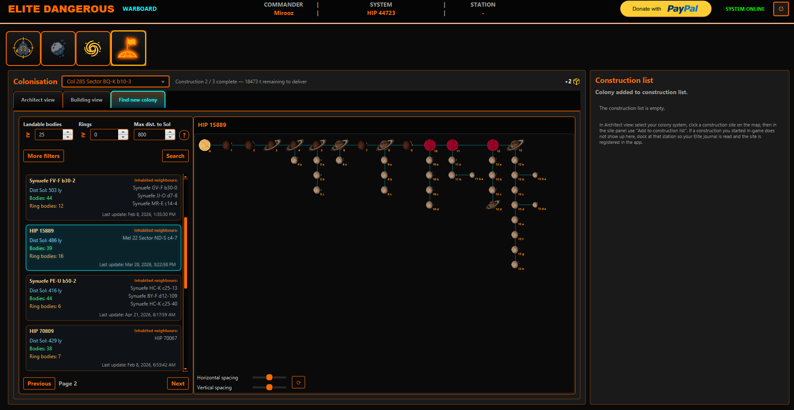

# Elite Dangerous Warboard

**Elite Warboard** is a comprehensive companion application designed to optimize your *Elite Dangerous* experience. It analyzes your commander **journal files in real time** to provide detailed insights into **pirate mission stacking** & combat, **mining** operations, **exploration & exobiology**, and **colonization** (including **Fleet Carrier** workflows for construction and market sourcing). Whether you focus on massacre stacking, mining expeditions, deep-space exploration, or tracking colony construction and supply, this dashboard helps you **track progress**, **find opportunities**, and **maximize your earnings**. Tools are grouped into four main areas—**Pirate mission stacking**, **Mining**, **Exploration & Exobiology**, and **Colonization**. Optional **Frontier CAPI** (OAuth) and **EDDN** publishing are available from settings.

---

## Pirate mission stacking

In *Elite Dangerous*, **pirate mission stacking** is taking several **massacre (pirate hunt)** missions that all want kills **in the same place** against the **same pirate minor faction**. Contracts can come from **different factions** on **different boards**; if they all name the **same target faction**, **one qualifying kill** usually adds **+1** to **every** stacked mission, and you **turn in each mission separately** for its own reward. **Source** systems are where you pick up missions; **target** systems are where you hunt (often a **resource extraction** area).

**What Warboard adds.** Live journal tracking: kills remaining **per target faction**, destroyed-ship log with bounties, **EdTools** / **SiriusCorp** system search from the header, and a **target overlay** so quotas stay visible over the game. **Stack pirate massacre missions in one place.**

**→ [Pirate mission stacking](docs/modules/missions.md)** (documentation — full in-game explanation, layout, combat search, tips)


---

## Mining

Track **active mining sessions** (refined tonnage, credits), compare **best sell price** vs **current station** prices, browse **session history**, and run **mining system search** by mineral. The **prospector overlay** floats commodity and session info over the game client.

**→ [Mining](docs/modules/mining.md)** (documentation — session lifecycle, price toggle, search flow)


---

## Exploration & Exobiology

**After you scan a planet**, Warboard **estimates which exobiology is likely present** there (**Bioforge**-based species probabilities), with **X/Y** sampling progress and exploration value. Around that: **system map (orrery)** (zoom/pan, body list), **navigation routes** (free route from `NavRoute.json` plus **Spansh**-backed modes: Stratum, Exomastery, Road to Riches), **route overlay**, **exploration history** (visited systems, **estimated scan value**, **discovered exobiology**), and optional **Synchronized system from Spansh** (planet data from Spansh **merged** with your journal so unscanned or partial bodies are easier to **preview**).

**→ [Exploration & Exobiology](docs/modules/exploration.md)** (documentation — route modes, overlays, radar, JSON panel)


---

## Colonization

See **constructions in progress** on the system map (**Architect**) and follow **tier impacts (T2/T3)** and site status from your journal so you always know where builds stand. **Optimal market search** makes **transport easier** by finding buy stations that **bundle as many of the commodities you still need as possible** (fewer stops), with distance, max-range filter, “use current system as source”, and **Fleet Carrier** order tie-ins. An optional **ED Colonize**-style finder helps discover new targets; **colonization overlay** and **CAPI** carrier tools support you in flight.

**→ [Colonization](docs/modules/colonisation.md)** (documentation — ongoing builds, multi-commodity market runs, FC, CAPI, overlay, screenshots)



---

## Global application features

These apply across the whole app (details: **[`docs/transversal.md`](docs/transversal.md)**).

| Area | What you get |
|------|----------------|
| **Journal** | Continuous tail of `.log` files; state rebuilt from journal + persisted registries. |
| **Language** | **English**, **French**, **German**, **Italian**, and **Spanish** UI, errors, and search copy. |
| **Commanders** | New-commander detection; preferences and snapshot data **scoped per FID**. |
| **Overlays** | Detachable windows (missions kills, exploration bodies, nav route, colonization, mining prospector); **multi-monitor** placement; sync with main window. |
| **CAPI** | Optional OAuth via Warboard for **station market** and **Fleet Carrier**; logout / decline flows; downtime messaging. |
| **EDDN** | Optional anonymized journal exports (separate toggle from CAPI); eligible event types are listed in-app. |
| **Analytics** | Optional **error log** upload to the analytics backend; **first-run consent** (off by default). |
| **Network** | Translated error popups; graceful handling when APIs or CAPI are unavailable. |

---

## External APIs

Third-party and online services consumed by Warboard:

- **EdTools API** — Massacre system search and hotspot detection  
- **Ardent API** — Market information  
- **SiriusCorp API** — Additional combat system search (pairs with EdTools)  
- **Spansh API** — Navigation routes (*Stratum Undiscovered*, *Expressway to Exomastery*, *Road to Riches*); **system/body search** to enrich exploration and colonization views; replaces former **EDSM** integration for online system data  
- **[ED Colonise](https://edcolonise.net/)** — Colonizable **system discovery** for the optional in-app finder (filters, body metrics, inhabited neighbours); upstream credits include **Spansh** for dumps and community telemetry (**EDDN**) on their side  
- **Frontier Companion API (CAPI)** — OAuth-backed access for **station markets** and **fleet carrier** data  
- **EDDN** — Optional player-contributed market telemetry (client path: `elite-eddn-client`)  
- **Canonn Bioforge** — Big-data exobiology species probability calculations ([bioforge.canonn.tech](https://bioforge.canonn.tech/))

**Client behaviour:** translated network error popups; live data when online features are used; graceful fallbacks when services are unavailable (including **CAPI maintenance** messaging). When **EDDN** publishing is enabled, the in-app configuration lists **eligible journal events**.

HTTP client modules and OpenAPI build notes: **[`docs/modules/elite-clients.md`](docs/modules/elite-clients.md)**.

---

## Supported journal events

Representative **`event`** types from Elite Dangerous journals that Warboard processes (coverage expands with game updates; handlers may filter or merge variants):

### Mission events

`MissionAccepted`, `MissionCompleted`, `MissionFailed`, `MissionRedirected`, `MissionAbandoned`, `MissionExpired`, `MissionProgress`

### Combat events

`Bounty`, `RedeemVoucher`, `FactionKillBond`, `CommitCrime`, `Died`, `ShipTargeted`

### Mining events

`MiningRefined`, `Cargo`, `ProspectedAsteroid`, `AsteroidCracked`, `LaunchDrone`, `EjectCargo`, `BuyDrones`, `SellDrones`, `MarketSell`

### Exploration & exobiology events

`Scan`, `ScanOrganic`, `SellExplorationData`, `MultiSellExplorationData`, `SellOrganicData`, `FSSBodySignals`, `SAAScanComplete`, `SAASignalsFound`, `ApproachBody`, `LeaveBody`, `Embark`, `Disembark`, `NavRoute`, `NavRouteClear`, `FSDTarget`, `FSSSignalDiscovered`

### Colonization & fleet carrier events

`ColonisationConstructionDepot`, `ColonisationContribution`, `ColonisationBeaconDeployed`, `CarrierTradeOrder`, `CarrierStats`, plus colonization-aware handling on **`Docked`** and **market** journal lines (generic `Docked` / `Undocked` are under **Ship**)

### Ship events

`Loadout`, `LoadGame`, `Location`, `Docked`, `Undocked`, `FSDJump`, `SupercruiseEntry`, `SupercruiseExit`, `ShutDown`

### Commander events

`Commander`

How each **area** uses these lines (workflows, overlays): **[Pirate mission stacking](docs/modules/missions.md)** · **[Mining](docs/modules/mining.md)** · **[Exploration & Exobiology](docs/modules/exploration.md)** · **[Colonization](docs/modules/colonisation.md)** · **[Cross-cutting](docs/transversal.md)**.

---

## More documentation

| Resource | Purpose |
|----------|---------|
| **[`docs/README.md`](docs/README.md)** | Documentation index (tools vs Maven layout) |
| **[`docs/changelog.md`](docs/changelog.md)** | Version history |
| **[`docs/depot-maven.md`](docs/depot-maven.md)** | Maven multi-module layout (developers) |
| **[`docs/modules/elite-warboard-missions.md`](docs/modules/elite-warboard-missions.md)** | Source tree of the main JavaFX app |

---

## Installation

### Windows

1. Download **`EliteWarboard-Setup.exe`** from the project’s **GitHub Releases** page.  
2. Run the installer.  
3. Start **Elite Warboard** from the Start Menu or desktop shortcut.

### Linux

1. Download **`.deb`** or **`.flatpak`** from Releases.

Bundled installers ship a **embedded JDK/JavaFX** where the build profile provides it—end users normally **do not** install Java separately.

### First launch

1. Set the **Elite Dangerous journal folder** (typical Windows path: `…\Saved Games\Frontier Developments\Elite Dangerous`).  
2. Pick your language (**English**, **French**, **German**, **Italian**, or **Spanish**).  
3. Play as usual; new journal lines are picked up automatically.

---

## Technology stack (build)

- **JDK 17**, **JavaFX 17**, **Maven**, **Jackson**, **Lombok**  
- **Inno Setup** / **jpackage** for installers

---

## Build & development

```bash
mvn clean install
```

- **Windows installer** (requires Inno Setup): `mvn clean install -P windows-installer`  
- **Linux installer**: `mvn clean install -P linux-installer`  
- **Run the app**: `cd elite-warboard-missions` then `mvn exec:java`

---

## License

[MIT License](LICENSE)

## Support

Confirm the journal path, that Elite is writing `.log` files, and that your network allows API calls. If something breaks, open a GitHub **issue** with reproduction steps.

## Donations

[](https://www.paypal.com/donate?hosted_button_id=2GSWMTWB4SHA2)
