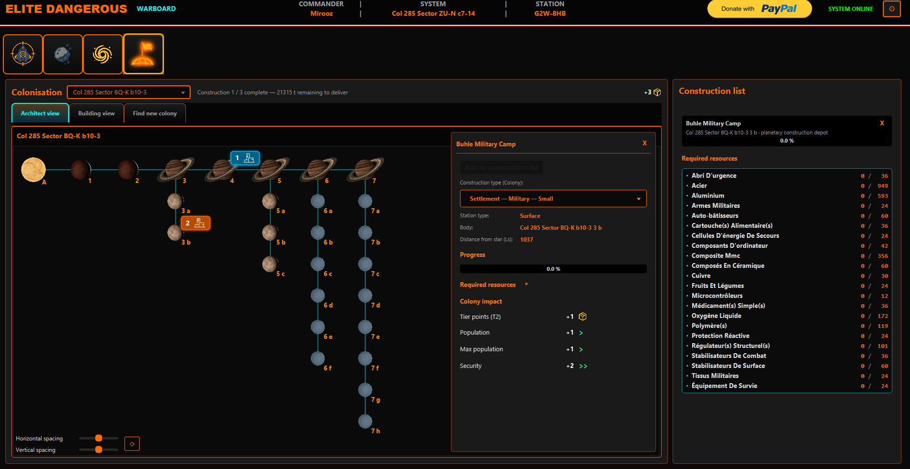
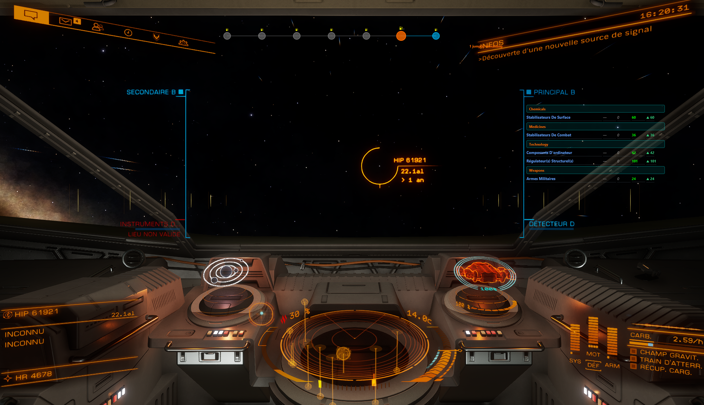
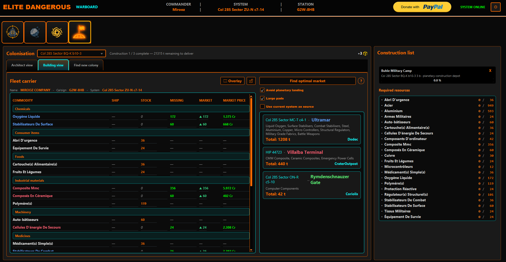

# Colonization tool

The **colonization tool** is mainly an **operations desk for colony construction**: visualize **sites you are already building**, use **Architect** and journal-driven updates to **track progress and impacts**, and run **optimal market searches** to source missing **commodities** efficiently. **Fleet Carrier** integration (orders vs cargo, optional **CAPI**) supports filling those markets from your carrier. An **ED Colonize**-style **system finder** (filters, pagination) is available when you want to **discover new colonizable targets**—secondary to day-to-day construction follow-up.

In the shipped UI, colonization and fleet-carrier panels often share one screen area; this page covers both.

---

## Architect — see existing constructions

- **Map your current builds** : active **construction sites** appear on the **orrery** (same body map component as **Exploration & Exobiology**), with **settlement chips** / captions so you see **what already exists** in-system.  
- **Tier awareness** : **T2/T3 impact** indicators and **system-wide** impact summaries help you understand how finished vs in-progress sites affect the bubble.  
- **Site selection** : **context menu** on a body to pick **orbital** vs **surface** lines when multiple construction lines exist.  
- **Journal sync** : `ColonisationConstructionDepot`, contributions, **beacon deployed**, and docking at depots refresh the map so the view matches **reality in-game**.

---

## Tracking construction

- **Active list** vs **completed** : completed sites roll off the active construction list per app rules so you focus on **ongoing** work.  
- **Depot context** : journal lines tie your commander to the **right market / site** when docked at a colony hub.  
- **Contributions** : `ColonisationContribution` (and related flows) update what still needs delivering.  
- **Colonization overlay** : optional compact view while flying or on foot so you do not lose track of status.

---

## Optimal market search (commodities)

When the Architect (or site workflow) shows **missing commodities**, open **optimal market** search:

- Ranks **buy stations** for the commodities you still need.  
- Shows **distance** to each candidate; optional **maximum distance** so you stay in-range of your carrier or bubble.  
- **Use current system as source** pins the search to your **logged star system** instead of an abstract reference point.  
- Pairs with **Fleet Carrier** `CarrierTradeOrder` lines so you can align **orders** and **cargo** before jumping.

---

## Fleet Carrier (CAPI)

Requires **CAPI login** (OAuth via Warboard—see [`docs/transversal.md`](../transversal.md)):

- **Carrier cargo** vs outstanding **buy/sell orders** (`CarrierTradeOrder`).  
- **Overlay** highlights **missing** commodities relative to your construction sourcing.  
- **Market grid** : commodities grouped by category / display name; periodic refresh.

---

## System search (optional — new colonizable targets)

When you want to **find a new system** to colonize (not only manage current builds):

- **Filters** : construction type, distance, **advanced** constraints (see in-app tooltips).  
- **Pagination** for large result sets.  
- Opening a result drives the **orrery** with optional **Spansh** body hydration when enabled in preferences.

---

## Typical user flow (construction-first)

1. Open **Architect** in a system where you are building—**verify sites** and **tiers** on the map.  
2. Read **progress / missing commodities** from the panel and journal-driven updates.  
3. Run **optimal market search**; constrain **distance** or anchor from **current system**; buy or line up **Fleet Carrier** orders.  
4. Use the **overlay** or **FC** sub-panel while moving cargo.  
5. *(Optional)* Run **ED Colonize** search when scouting a **new** colony location.

---

## Journal events (primary for this tool)

| Event | Role |
|-------|------|
| `ColonisationConstructionDepot` | Depot / construction dock context. |
| `ColonisationContribution` | Materials delivered to a site. |
| `ColonisationBeaconDeployed` | Beacon placed for the colony project. |
| `CarrierTradeOrder` | FC commodity order lines for sourcing UI. |
| `Docked` | When at colonization-related stations, refreshes colonization services. |
| `CarrierStats`, market buys | Refresh carrier inventory and panels. |

**CAPI/OAuth** behaviour (login, logout, decline, browser failure fallback, downtime banners) is documented under **[Online services](../transversal.md#online-services-capi-eddn-analytics)**.

---

## Practical tips

- Treat **Architect + journal** as the source of truth for **what is already under construction** before plotting new buys.  
- Log in to **CAPI** if you need **live** FC prices; offline journal still updates many fields.  
- Use **max distance** on optimal-market results to avoid impractical cross-galaxy buys.

---

- [← Documentation index](../README.md)  
- [Missions](./missions.md) · [Mining](./mining.md) · [Exploration & Exobiology](./exploration.md) · [Cross‑cutting features](../transversal.md)  
- [External APIs reference](./elite-clients.md#external-apis)
